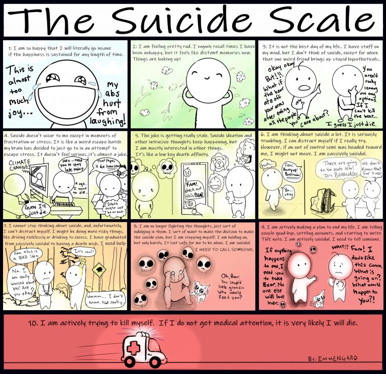

# Me VS Depression

A repository for me to write about my thoughts/feelings, try to understand them and possibly help someone in the meantime. In case you feel similar to me, feel free to reach out any time! I have another repo called "socials" where you can probably find a communication-channel that works for both of us.

## 29/06/2023 Holding on (for now)

Still think about suicide daily, but currently not truly considering it.

I should move out of this country. To a country where I feel safe, get a remote job, and live life.

Think I feel slightly better because I did things that I dreaded to do for ages.
3 of those things were:

1. starting on a making a youtube video
2. writing a letter to my dad
3. stream a bit

My brother has vacation now, and went abroad. I miss him a ton.

Think what got me to tip back over the edge this time was wifey, idk why, but during the stream she was struggling so bad, and for the first time, I feel like she enjoyed coding. Absolutely loved being able to read that off her face. It is like watching someone succeed in something for the first time, it is always so cute and wholesome.

Lately just feeling sad, not really suicidal (somewhat) anymore.

Still feeling as if life sucks, and its not necessarily worth living, but my time on this planet got extended for a bit.

## 17/06/2023 Make it make sense

I try to be present as much as possible, but sometimes, the past catches up. Every so often, you get burried under 100m of dirt and feel like you are unable to breath. As if time has folded in on itself, merging past, present and future into an inescapable labyrinth.

I never feel like wanting to take drugs as an escape from this overwhelming feeling, although sometimes I seriously consider it. Or wonder what a little buzz could do, would it actually make your feel good? Or is it just temporary bliss, an illusory sanctuary, after which the real world comes crashing back in, strucking you with lightning on the way down, leaving you more shattered than ever before. Who wouldn't want to escape daily life, even if it was for a bit? Escapism however, might not be the answer to anything, since its a mere deceptive siren's call that drowns out the symphony of life, leaving one adrift in a sea of illusions. It is however oh, so tempting, and I can truly empathize with those whom fall for it!

But here's the deal dude, life ain't meant to be escaped, it's meant to be lived. So why is everyone working for vacations, a temporary pause of the every day life? Everyone I know, is working towards a longer vacation, instead of living life. Too worried and caught up in capitalism. We are chasing after those vacations, dreaming of sandy beaches and icy cocktails, hoping that those precious moments will somehow make up for the monotony of everyday life. It's messed up how we've been conditioned to believe that our existence is all about escapin' the very thing we are living.

We, as in we the people, are fucked. Everyone who doesn't own a major company, even the petty bourgeoisie, we all are majorly fucked.

## 15/06/2023 Why depressed?

Short answer: idfk, what do you think?

Long answer:
Might have something to do with the shit I have been through. Most of my memories of my mother are those of a child being mentally abused. Made to belief things, things that the child weren't true. But someone you look up to persisting they are, inducing emotions for her own gain, playing a game without a goal in sight.

I always felt as if she was out to do as much damage as humanly possible. And I am not sure what's worse, that it is my own mother who, to an extend, ruined my life and the lives of those in my family, or that she actually still stalks me to this day.
How twisted and absolutely fucked do you need to be?

Just hope I have inherited as little as possible... Last thing I want, is to do anything remotely similar to the people in my life, or even be anything like her.

Hope I haven't injured others too much, during my existence. People nowadays are so bitter, they fake friendliness, hide honesty to behind closed doors. What are they so afraid of? If anything, I'd appreciate a little more honesty in my life. Honesty doesn't mean or excuse rudeness, you can be honest and kind at the same time.

Anyways, back to why I am so fucked.

My mom is the kind of person that seems super knid and sociable at first. She hides her hideous intentions behind a smile. Then little by little, she starts to lift the mask. Aks if you have some excess clothing, in order to plant a seed. The next few times, she mentions other minor stuff. And eventually starts to ask for money when you think you built-up a somewhat good relation... Of all the times I saw her literally steal other peoples hard earned money, she never regretted it and even seemed to enjoy it. She'll act like a supportive friend and figure out what you want to accomplish in life. To eventually use that against you and make you dependant on her. I've seen it too many times. Her sociopathic/psychopathic tendensies are invisble to people from the outside. She knows how to manipulate everyone and anyone. A true danger to society!

I feel like I hate my "home" country because of her. I'd rather be in any other country than the one I am currently living in. This country makes me feel depressed. The constant thought in the back of your mind. The paranoia kicks in. You don't feel safe anywhere,and absolutely miserable everywhere.

Since she's capable of manipulating anyone and doing anything. She can come out of any corner. You can't trust kindness from anyone or accept their willingness to help. You don't know who could be behind it.

Wish life was a bit simpeler and I wouldn't have to look over my shoulder on every checkpoint in this game. Just to make sure the boogey-woman doesn't suddenly show up and absolutely ruins everything.

I realise that I am leaving out many key details, and its on purpose. The craziest shit isn't worth telling to anyone. The fewer thoughts I can give about this piece of shit human being, the better!

That'll be the end of talking about her then?!? Hopefully...

## 14/06/2023 Internalized thoughts

This image represents to a certain degree how I feel that people look at me and how I look at others.

Let's imagine that the glass represents the experience of depression We both are on other sides of the glass, looking through it, but its cloudy, hard to see things clear, hard to see the other side. Both of us are on opposite sides of the glass, trying to understand and connect with each other, but the glass is cloudy, making it difficult to see things clearly and hindering our ability to fully comprehend the other side.

On one side of the glass is the person experiencing depression. They may feel trapped, isolated, and unable to fully express or communicate their thoughts and emotions. The cloudiness of the glass symbolizes the distortion and confusion that depression can bring, making it challenging for others to grasp the depth of their experience.

On the other side of the glass is the person trying to understand and possibly support the other individual. They may have genuine care and concern, but the cloudiness of the glass makes it hard to perceive the full extent of what the other person is going through. They may struggle to comprehend the emotional pain and internal struggles associated with depression.

Just like looking through cloudy glass, it requires patience, empathy, and active efforts to gain a clearer understanding of the other side. It involves actively listening, seeking information about depression, and being open to the perspectives and experiences of the person living with depression.

It's important to acknowledge that while we may not fully see or comprehend everything on the other side of the glass, we can still offer support, compassion, and reassurance. By extending a hand, providing a listening ear, and showing empathy.

Ultimately, I am trying to show the importance of empathy, patience, and the willingness to learn and understand the experiences of those facing depression. By acknowledging the cloudiness of the glass and actively working to gain a clearer view, we can foster a supportive environment that promotes healing and well-being. One day society (hopefully) will be more understanding.

Today, is not that day...

## 13/06/2023 Suicide scale

Yesterday evening, I saw this funny representation of how far into suicide you are.

I feel like most people I know are about a 2 on the scale. Wonder what I'd be if I could be objective about it. What's your rating on the scale?

## 12/06/2023 Integral

Once upon a time, there was a person who carried a heavy burden deep within themselves. It was a burden called depression. At first, it was just a whisper, a subtle feeling of sadness that lingered in their heart. But as time went on, it grew louder, gradually permeating every corner of their existence.

Depression became more than just an emotion; it was a constant companion that shadowed their every step. It cast a heavy weight upon their shoulders, making even the simplest tasks feel like monumental challenges. The person's once vibrant thoughts and joyful moments began to fade, replaced by a persistent emptiness that seemed impossible to fill.

As days turned into weeks, and weeks turned into months, depression dug its claws deeper into their psyche. It distorted their thinking, convincing them that happiness was an illusion and that they were destined to remain trapped in this dark, endless tunnel. The person's energy waned, leaving them weary and drained, as if their very essence was being consumed by the relentless grip of depression.

At times, they tried to push it away, fighting against the suffocating presence that had become so ingrained within them. But no matter how hard they fought, depression remained steadfast, clinging to their identity like an uninvited guest who refused to leave.

With each passing day, depression whispered insidious lies, chipping away at their self-esteem and hope. It created a distorted mirror through which they saw themselves, distorting their perception until they questioned their worth and doubted their ability to ever escape its grasp.

Yet, deep within their core, a flicker of resilience remained. A constant thought: "Is this what defines me"? Or will I reign victorious?

## 07/06/23 Understanding

Since I was 12-13 years old, I have thought at least once about suicide every day. Which is probably the most constant thing that I've actively/passively been doing. Nothing in my life has been as constant as this weird abstract feeling of not wanting to be alive. Why is it so prevalent?

I have always felt as if I had to supress my feelings, part of it was probably to avoid getting bullied and/or taken advantage of. Maybe I should get more in touch with my emotions again, but how?

A note for **if you don't understand depression**:

1. no one wants to be depressed, its not a choice
2. there is most likely a cause(-s) for depression, events that ...
3. either you can get out of it, or eventually you get out of it -> only 2 end stages
4. its not easy to get rid of it, you can't just "snap out of it"
5. its not just feeling sad and low, but rather a persistent and very invasive emotion/mood that stays with you, often for months or even years
6. it is often hidden in plain sight, the person that you like to talk to, might very well be depressed, you can't see it on someone's façade
7. its very often misunderstood by everyone that doesn't have it or haven't directly come in contact with it
8. not everyone with depression wants to die

Not to say, I'd rather be anything but depressed.

## 05/06/23 - You're not alone

All I want to do, is to be of service to others, even when that means my downfall. Why do I want to help others?
Why did I create this repository?
Maybe because I have empathy?
Because I know how it feels like to think you're alone in this? I feel it daily.
Maybe because I wish, that someone one day will be there for me? I try to be that someone for someone else.

You're not alone, I am out here! But am I ...?

## 04/06/23 - No end in sight

I don't see how I could get rid of this. When it will go away. How it can go away.

How I can make it go away.

A permanent feeling, something or someone that's haunting you.

It stalks you everywhere you go. There is no hiding. No moment of rest.

Maybe, I'm too demanding, and just have to let it go. Not be busy with it every so often. In order for it to leave my mind, me... .

Maybe I shouldn't let it rest. Or maybe I really should let it rest. Otherwise it might be me that rests.

## 01/06/23 - Everlasting sadness

Often I get told that I have no right to be depressed, because I have a fairly decently paying job, a wife, a family that loves/supports me, ... . The life some people wished they had, I guess. That however doesn't help to get rid of this everlasting/omnipresent feeling. Whatever I do, this weird feeling follows me, eats away any other feeling. Its like falling into a pit, deeper and deeper -> day by day, with no end in sight. Like one of the nightmares I had when I was younger: I'd wake up, be in my bed, but my bedroom had no walls, it was a freestanding platform with a bed in the corner, surrounded by void on all sides, the only way to escape the platform was by jumping of it, falling into the endless void, till I got looped back to the bed and woke up again, and again, always on repeat, for night on end.

In my experience this feeling, of not being able to escape this room, is what depression feels like. Wherever I go, wherever I am, whatever I do, this nightmare follows me and nibbles pieces of me.

I've gone to therapists in the past, with no real effect.

The weird things is, I don't want my life to be all that much different. Just in a few specific areas, like the location/country I live in, get rid of depression, ... . Very non vital desires, that wouldn't impact my life in a huge way, compared to someone not earning a decent wage or something and hitting the "jackpot".

Life is weird. People are weird. Computers are weird. Everything is weird.

## 30/05/23 - Why do I even bother?

What is there to live for? Everyone is screwed from the start. The politicians are against the people, the people are against their peers.

Even in daily life, everyone is so cold. Like no one cares about what'd happen. If I'd jump off a building or in front of a train, people would stare and go back to work. We are all a bunch of pussies, sheep, emotionless beings. There is nothing of beauty to find in most humans, just cold stares as soon as you get near to them.

For as long as I can remember I've been feeling empty. Like my emotions come and go, but there is only 1 that truly sticks. A permanent feeling of sadness, for whatever reason, and something that's unexplicable. How can I get rid of this?

I feel as I'm in service of others, instead of myself. How can I help others, if I can't help myself with this "demon".

This feeling of emptiness makes me hate myself. I can't do anything good.

Recently I listened to [this song of XXXTENTACTION](https://www.youtube.com/watch?v=e3U1TKgwoxE) for the first time in a while, I feel somewhat understood, not by the music, but the cover art stating: "I do the same fucking shit everyday. Everyday feels like Sunday I cannot escape. My mind is sick, my mind is fucking sick. I am not satisfied with anything. I do not care about progressing in life. Throughout my life I cared about other people who did not care about me. No one truly cares anyway. Life is just a waste of time. Even though my family says they care. Deep down, they do not. Friends will come and go. You know my fucking life is a joke and I'm truly lost in life. My friend saved my life. My friend saved my fucking life. Its getting less stressful and crazy now but still I'm lost. I see the fake humans and their fake smiles with their fake love. I'll fucking kill all of them. I am not crazy. I truly am not. The only reason I am alive is because of the people who were there for me when I was crying desprerately for help. Help. Help. My real family is dead to me. But I will always love them. They didn't want to accept the fact that I was fucked up. You're not depressed you're not sad you're wasting your time, they didn't get it until it was over. I saw everything before it happened.
No one cared until they saw me progressing . Losing friends was the best thing that has ever happened to me. Now people come in my life, I am very grateful for them and everyone around me. I constantly get let down . I always get let down. Maybe because I expect so much from people who truly don't give a fuck about me. I get attached to people I shouldn't have. I expect too much. Might as well say fuck 'em. And fuck it. I'll die alone. HAHAHA. I'm such a fucking pussy. Depressed hopeless. Well at least I know who I am.".

How is it possible that I have more in common with a dead man, that lived on the other side of the planet, than most of those I am surrounded by? Why do his words touch my heart, make me tear up? He and his words, were also the inspiration for this repo?!.

Even though, I have no idea what this man has gone through. I respect him a ton. I wish this feeling of complete and utter uselessness on no one, not even my worst enemy. Yet it is something I have to bear everyday. Sometimes, if people only felt a sliver of how bad I constantly feel, maybe then they'd understand, maybe then we could have a real conversation, not hiding behind facades.

Socail-media and everything surrounding it is a disease to society. The only somewhat true social media is livestreaming, people can't hide who they really are there, or at least less, people are more pure, the way everyone should be.

Pure people are hard to come by, and those that I treasure the most, respect without knowing them. Often you can just feel when someone is pure and see easily those who hide behind facades, trying to fit in, trying to be accepted, instead of just being themselves.
